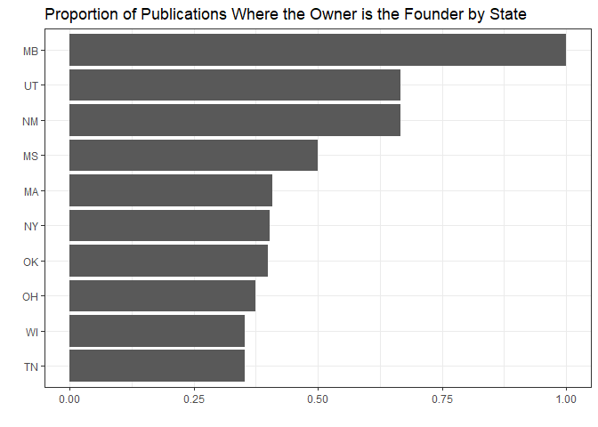
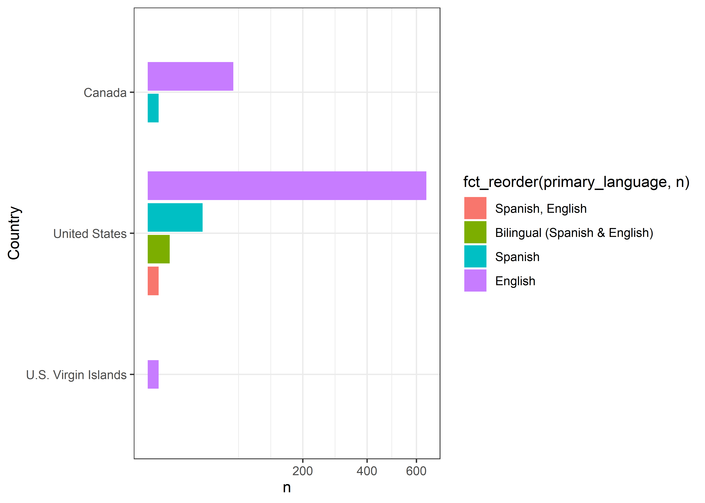

Digital Publications
================
Matthew
4/5/2022

``` r
news <- read_csv('https://raw.githubusercontent.com/rfordatascience/tidytuesday/master/data/2022/2022-04-05/news_orgs.csv')
```

    ## Rows: 741 Columns: 40
    ## -- Column specification --------------------------------------------------------
    ## Delimiter: ","
    ## chr (33): publication_name, parent_publication, url, owner, is_owner_founder...
    ## dbl  (1): year_founded
    ## lgl  (6): primary_language_other, coverage_topics_other, revenue_stream_othe...
    ## 
    ## i Use `spec()` to retrieve the full column specification for this data.
    ## i Specify the column types or set `show_col_types = FALSE` to quiet this message.

``` r
news <- news %>% 
  select(-url)
skimr::skim(news)
```

|                                                  |      |
|:-------------------------------------------------|:-----|
| Name                                             | news |
| Number of rows                                   | 741  |
| Number of columns                                | 39   |
| \_\_\_\_\_\_\_\_\_\_\_\_\_\_\_\_\_\_\_\_\_\_\_   |      |
| Column type frequency:                           |      |
| character                                        | 32   |
| logical                                          | 6    |
| numeric                                          | 1    |
| \_\_\_\_\_\_\_\_\_\_\_\_\_\_\_\_\_\_\_\_\_\_\_\_ |      |
| Group variables                                  | None |

Data summary

**Variable type: character**

| skim\_variable                                    | n\_missing | complete\_rate | min |  max | empty | n\_unique | whitespace |
|:--------------------------------------------------|-----------:|---------------:|----:|-----:|------:|----------:|-----------:|
| publication\_name                                 |          0 |           1.00 |   3 |   51 |     0 |       739 |          0 |
| parent\_publication                               |        683 |           0.08 |   7 |   91 |     0 |        42 |          0 |
| owner                                             |        482 |           0.35 |   4 |   92 |     0 |       244 |          0 |
| is\_owner\_founder                                |          0 |           1.00 |   2 |    3 |     0 |         2 |          0 |
| city                                              |         43 |           0.94 |   3 |   39 |     0 |       468 |          0 |
| state                                             |         13 |           0.98 |   2 |    2 |     0 |        58 |          0 |
| country                                           |          0 |           1.00 |   6 |   19 |     0 |         3 |          0 |
| primary\_language                                 |          3 |           1.00 |   7 |   29 |     0 |         4 |          0 |
| tax\_status\_founded                              |        450 |           0.39 |   3 |   39 |     0 |         8 |          0 |
| tax\_status\_current                              |          3 |           1.00 |   3 |   39 |     0 |         9 |          0 |
| total\_employees                                  |        444 |           0.40 |   1 |   10 |     0 |         8 |          0 |
| budget\_percent\_editorial                        |        456 |           0.38 |   4 |    6 |     0 |        10 |          0 |
| budget\_percent\_revenue\_generation              |        457 |           0.38 |   4 |    5 |     0 |         9 |          0 |
| budget\_percent\_product\_technology              |        457 |           0.38 |   4 |    6 |     0 |         9 |          0 |
| budget\_percent\_administration                   |        460 |           0.38 |   4 |    6 |     0 |        10 |          0 |
| products                                          |        456 |           0.38 |   6 |  140 |     0 |       118 |          0 |
| products\_other                                   |        739 |           0.00 |   5 |    8 |     0 |         2 |          0 |
| distribution                                      |        455 |           0.39 |   5 |  138 |     0 |        70 |          0 |
| distribution\_method\_other                       |        740 |           0.00 |  10 |   10 |     0 |         1 |          0 |
| geographic\_area                                  |        454 |           0.39 |   9 |  106 |     0 |        17 |          0 |
| core\_editorial\_strategy\_characteristics        |        461 |           0.38 |  18 |  164 |     0 |        58 |          0 |
| core\_editorial\_strategy\_characteristics\_other |        735 |           0.01 |  16 |   24 |     0 |         6 |          0 |
| coverage\_topics                                  |        456 |           0.38 |   4 |  283 |     0 |       240 |          0 |
| underrepresented\_communities                     |        618 |           0.17 |  15 |  149 |     0 |        48 |          0 |
| underrepresented\_communities\_not\_listed        |        732 |           0.01 |   5 |   42 |     0 |         7 |          0 |
| revenue\_streams                                  |        463 |           0.38 |   6 |  165 |     0 |       109 |          0 |
| revenue\_stream\_largest                          |        463 |           0.38 |   6 |   64 |     0 |        17 |          0 |
| revenue\_streams\_largest\_other                  |        740 |           0.00 |  16 |   16 |     0 |         1 |          0 |
| paywall\_or\_gateway                              |        535 |           0.28 |   5 |   61 |     0 |         6 |          0 |
| advertising\_products                             |        466 |           0.37 |   5 |  171 |     0 |        65 |          0 |
| real\_world\_impacts                              |        522 |           0.30 |  34 | 2533 |     0 |       218 |          0 |
| summary                                           |         58 |           0.92 |  24 |  591 |     0 |       677 |          0 |

**Variable type: logical**

| skim\_variable                    | n\_missing | complete\_rate | mean | count |
|:----------------------------------|-----------:|---------------:|-----:|:------|
| primary\_language\_other          |        741 |              0 |  NaN | :     |
| coverage\_topics\_other           |        741 |              0 |  NaN | :     |
| revenue\_stream\_other            |        741 |              0 |  NaN | :     |
| revenue\_stream\_additional\_info |        741 |              0 |  NaN | :     |
| paywall\_or\_gateway\_other       |        741 |              0 |  NaN | :     |
| advertising\_product\_other       |        741 |              0 |  NaN | :     |

**Variable type: numeric**

| skim\_variable | n\_missing | complete\_rate |    mean |   sd |   p0 |  p25 |  p50 |  p75 | p100 | hist  |
|:---------------|-----------:|---------------:|--------:|-----:|-----:|-----:|-----:|-----:|-----:|:------|
| year\_founded  |          5 |           0.99 | 2011.42 | 6.96 | 1958 | 2009 | 2013 | 2016 | 2021 | ▁▁▁▂▇ |

# EDA

## Owner/Founder

``` r
news %>% 
  group_by(state) %>% 
  summarize(n = mean(is_owner_founder == "Yes")) %>% 
  arrange(-n) %>% 
  head(10) %>% 
  ggplot(aes(n, fct_reorder(state,n))) + geom_col() +
  labs(y = "", x = "", title = "Proportion of Publications Where the Owner is the Founder by State")
```

<!-- -->

``` r
news %>% 
  filter(state == "MB") %>% 
  count(is_owner_founder)
```

    ## # A tibble: 1 x 2
    ##   is_owner_founder     n
    ##   <chr>            <int>
    ## 1 Yes                  1

``` r
news %>% 
  filter(country != "United States") %>% 
  count(state, sort = TRUE)
```

    ## # A tibble: 10 x 2
    ##    state     n
    ##    <chr> <int>
    ##  1 ON       26
    ##  2 BC       16
    ##  3 AB        9
    ##  4 NS        3
    ##  5 QC        3
    ##  6 NT        2
    ##  7 SK        2
    ##  8 MB        1
    ##  9 NB        1
    ## 10 <NA>      1

``` r
news %>% 
  group_by(country) %>% 
  distinct(state) %>% 
  summarize(n = n())
```

    ## # A tibble: 3 x 2
    ##   country                 n
    ##   <chr>               <int>
    ## 1 Canada                  9
    ## 2 U.S. Virgin Islands     1
    ## 3 United States          50

``` r
news %>% 
  count(tax_status_current, sort = TRUE)
```

    ## # A tibble: 10 x 2
    ##    tax_status_current                          n
    ##    <chr>                                   <int>
    ##  1 For Profit                                348
    ##  2 LLC                                       128
    ##  3 Not for Profit                            116
    ##  4 Nonprofit 501c(3) or Canadian nonprofit    52
    ##  5 Sole Proprietor/no specific tax status     39
    ##  6 S Corp                                     29
    ##  7 Under umbrella of a 501c(3)                18
    ##  8 Partnership                                 4
    ##  9 Public-benefit corporation                  4
    ## 10 <NA>                                        3

``` r
news %>% 
  filter(is.na(year_founded))
```

    ## # A tibble: 5 x 39
    ##   publication_name   parent_publicat~ owner is_owner_founder city  state country
    ##   <chr>              <chr>            <chr> <chr>            <chr> <chr> <chr>  
    ## 1 Eye On Annapolis   <NA>             <NA>  Yes              Anna~ MD    United~
    ## 2 Hoptown Chronicle  <NA>             <NA>  Yes              Hopk~ KY    United~
    ## 3 North Penn Now     <NA>             <NA>  Yes              Lans~ PA    United~
    ## 4 The Oaklandside    <NA>             <NA>  Yes              Oakl~ CA    United~
    ## 5 Webb City Sentinel <NA>             Zinc~ No               Webb~ MO    United~
    ## # ... with 32 more variables: primary_language <chr>,
    ## #   primary_language_other <lgl>, tax_status_founded <chr>,
    ## #   tax_status_current <chr>, year_founded <dbl>, total_employees <chr>,
    ## #   budget_percent_editorial <chr>, budget_percent_revenue_generation <chr>,
    ## #   budget_percent_product_technology <chr>,
    ## #   budget_percent_administration <chr>, products <chr>, products_other <chr>,
    ## #   distribution <chr>, distribution_method_other <chr>, ...

``` r
news %>% 
  filter(!is.na(tax_status_current), !is.na(year_founded)) %>% 
  group_by(year_founded) %>% 
  ggplot(aes(fill = year_founded, y = tax_status_current, group = year_founded)) + 
  geom_bar(position = "dodge") +
  scale_fill_viridis_c() + labs(y = "", x = "", title = "Number of Publications", fill = "Year")
```

<!-- -->
