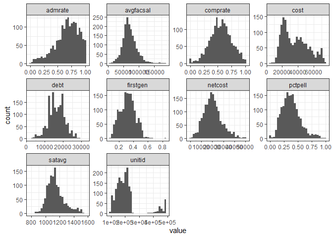

Work
================
Matthew
4/5/2022

# Q1

``` r
scorecard <- read_csv("C:/Users/Matthew Hondrakis/Downloads/scorecard.csv")
```

    ## New names:
    ## * `` -> ...1

    ## Rows: 1753 Columns: 15
    ## -- Column specification --------------------------------------------------------
    ## Delimiter: ","
    ## chr  (4): name, state, type, locale
    ## dbl (11): ...1, unitid, admrate, satavg, cost, netcost, avgfacsal, pctpell, ...
    ## 
    ## i Use `spec()` to retrieve the full column specification for this data.
    ## i Specify the column types or set `show_col_types = FALSE` to quiet this message.

``` r
scorecard <- scorecard %>% select(-1)
skimr::skim(scorecard)
```

|                                                  |           |
|:-------------------------------------------------|:----------|
| Name                                             | scorecard |
| Number of rows                                   | 1753      |
| Number of columns                                | 14        |
| \_\_\_\_\_\_\_\_\_\_\_\_\_\_\_\_\_\_\_\_\_\_\_   |           |
| Column type frequency:                           |           |
| character                                        | 4         |
| numeric                                          | 10        |
| \_\_\_\_\_\_\_\_\_\_\_\_\_\_\_\_\_\_\_\_\_\_\_\_ |           |
| Group variables                                  | None      |

Data summary

**Variable type: character**

| skim\_variable | n\_missing | complete\_rate | min | max | empty | n\_unique | whitespace |
|:---------------|-----------:|---------------:|----:|----:|------:|----------:|-----------:|
| name           |          0 |              1 |   6 |  75 |     0 |      1739 |          0 |
| state          |          0 |              1 |   2 |   2 |     0 |        54 |          0 |
| type           |          0 |              1 |   6 |  19 |     0 |         3 |          0 |
| locale         |          0 |              1 |   4 |   6 |     0 |         4 |          0 |

**Variable type: numeric**

| skim\_variable | n\_missing | complete\_rate |      mean |       sd |        p0 |       p25 |       p50 |       p75 |      p100 | hist  |
|:---------------|-----------:|---------------:|----------:|---------:|----------:|----------:|----------:|----------:|----------:|:------|
| unitid         |          0 |           1.00 | 208499.56 | 89834.30 | 100654.00 | 155627.00 | 193061.00 | 219949.00 | 491710.00 | ▇▇▁▁▂ |
| admrate        |          0 |           1.00 |      0.67 |     0.21 |      0.00 |      0.55 |      0.69 |      0.83 |      1.00 | ▁▂▅▇▆ |
| satavg         |        475 |           0.73 |   1143.53 |   124.20 |    785.00 |   1060.00 |   1124.00 |   1202.00 |   1566.00 | ▁▆▇▂▁ |
| cost           |         41 |           0.98 |  36332.31 | 15960.27 |   5810.00 |  22622.50 |  33729.00 |  47563.75 |  75735.00 | ▃▇▆▃▂ |
| netcost        |         35 |           0.98 |  20383.85 |  8134.15 |    822.00 |  14723.50 |  19772.50 |  24916.00 |  50794.00 | ▂▇▆▂▁ |
| avgfacsal      |         16 |           0.99 |  70062.94 | 23100.04 |   4077.00 |  55863.00 |  67329.00 |  81756.00 | 184356.00 | ▁▇▃▁▁ |
| pctpell        |          4 |           1.00 |      0.38 |     0.17 |      0.00 |      0.26 |      0.36 |      0.47 |      1.00 | ▂▇▅▁▁ |
| comprate       |         51 |           0.97 |      0.55 |     0.19 |      0.00 |      0.43 |      0.56 |      0.68 |      1.00 | ▁▃▇▆▂ |
| firstgen       |        167 |           0.90 |      0.32 |     0.10 |      0.09 |      0.25 |      0.32 |      0.39 |      0.85 | ▃▇▃▁▁ |
| debt           |        108 |           0.94 |  16429.44 |  4409.34 |   2500.00 |  13405.00 |  16446.00 |  19500.00 |  32500.00 | ▁▅▇▂▁ |

``` r
scorecard %>%
  keep(is.numeric) %>% 
  gather() %>% 
  ggplot(aes(value)) + geom_histogram() +
  facet_wrap(~key, scales = "free")
```

    ## `stat_bin()` using `bins = 30`. Pick better value with `binwidth`.

<!-- -->

# Q2

``` r
scorecard %>% 
  filter(firstgen > 0.6) %>% 
  select(name, type)
```

    ## # A tibble: 5 x 2
    ##   name                                        type               
    ##   <chr>                                       <chr>              
    ## 1 Pacific College                             Private, for-profit
    ## 2 Talmudical Seminary of Bobov                Private, nonprofit 
    ## 3 California State University-Los Angeles     Public             
    ## 4 Hodges University                           Private, nonprofit 
    ## 5 Southern California Institute of Technology Private, for-profit

# Q3

``` r
scorecard %>% 
  arrange(-cost) %>% 
  head(3) %>% 
  select(name,type)
```

    ## # A tibble: 3 x 2
    ##   name                                        type              
    ##   <chr>                                       <chr>             
    ## 1 University of Chicago                       Private, nonprofit
    ## 2 Jewish Theological Seminary of America      Private, nonprofit
    ## 3 Columbia University in the City of New York Private, nonprofit

# Q4

``` r
scorecard %>% 
  group_by(type) %>% 
  summarize(mean = mean(satavg, na.rm = TRUE)) %>% 
  arrange(-mean)
```

    ## # A tibble: 3 x 2
    ##   type                 mean
    ##   <chr>               <dbl>
    ## 1 Private, nonprofit  1153.
    ## 2 Public              1129.
    ## 3 Private, for-profit 1068.

# Q5

``` r
scorecard %>% 
  filter(grepl("Princeton", name)) %>% 
  select(cost)
```

    ## # A tibble: 1 x 1
    ##    cost
    ##   <dbl>
    ## 1 66950

``` r
scorecard %>% 
  filter(type == "Private, nonprofit") %>% 
  summarize(prop = mean(cost > 66950, na.rm = TRUE))
```

    ## # A tibble: 1 x 1
    ##     prop
    ##    <dbl>
    ## 1 0.0846
