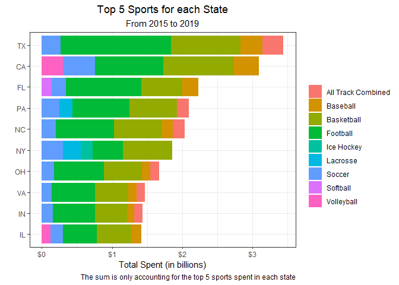
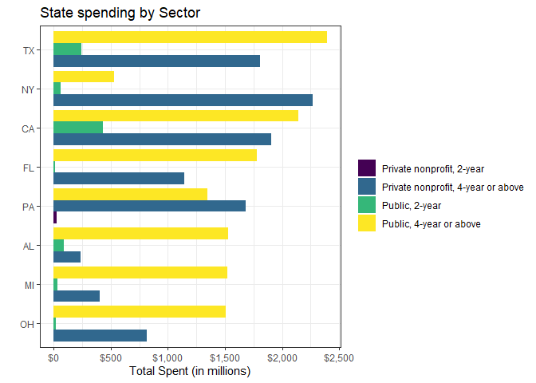

Sports
================
Matthew
3/29/2022

``` r
sports <- read_csv('https://raw.githubusercontent.com/rfordatascience/tidytuesday/master/data/2022/2022-03-29/sports.csv')
```

    ## Rows: 132327 Columns: 28
    ## -- Column specification --------------------------------------------------------
    ## Delimiter: ","
    ## chr  (8): institution_name, city_txt, state_cd, zip_text, classification_nam...
    ## dbl (20): year, unitid, classification_code, ef_male_count, ef_female_count,...
    ## 
    ## i Use `spec()` to retrieve the full column specification for this data.
    ## i Specify the column types or set `show_col_types = FALSE` to quiet this message.

``` r
sports <- sports %>% 
  rename(state = state_cd,
         sport = sports) %>% 
  rename_with( ~ gsub("_menwomen","",.x))
```

# EDA

``` r
sports %>%
  keep(is.numeric) %>%
  select(-year) %>%
  gather() %>%
  ggplot(aes(value)) + geom_histogram() + facet_wrap(~key, scales = "free")
```

    ## `stat_bin()` using `bins = 30`. Pick better value with `binwidth`.

<!-- -->

``` r
sports %>%
  keep(is.numeric) %>%
  summarize_all(~ mean(is.na(.))) %>%
  select_if(. > 0) %>%
  gather() %>%
  arrange(-value)
```

    ## # A tibble: 10 x 2
    ##    key               value
    ##    <chr>             <dbl>
    ##  1 partic_coed_men   0.994
    ##  2 partic_coed_women 0.994
    ##  3 partic_men        0.532
    ##  4 rev_men           0.532
    ##  5 exp_men           0.532
    ##  6 rev_women         0.479
    ##  7 partic_women      0.479
    ##  8 exp_women         0.479
    ##  9 total_rev         0.342
    ## 10 total_exp         0.342

``` r
sports %>%
  select(partic_coed_men) %>%
  count(partic_coed_men, sort = TRUE)
```

    ## # A tibble: 52 x 2
    ##    partic_coed_men      n
    ##              <dbl>  <int>
    ##  1              NA 131560
    ##  2               1     65
    ##  3               3     65
    ##  4               2     61
    ##  5               6     54
    ##  6               5     48
    ##  7               8     48
    ##  8               7     46
    ##  9               4     43
    ## 10              12     34
    ## # ... with 42 more rows

## Total Expenditure

``` r
sports %>% 
  filter(!is.na(total_exp)) %>% 
  group_by(state) %>%
  summarize(n = sum(total_exp)/1e9) %>%
  arrange(-n) %>% 
  head(15) %>%
  ggplot(aes(n, fct_reorder(state,n))) + geom_col() +
  labs(y = "", x = "Total Expenditure (in millions)", title = "Total Spent by State") +
  theme(plot.title = element_text(hjust = 0.5))
```

<!-- -->

``` r
(names <- sports %>%
  filter(!is.na(state)) %>%
  select(state, sport, total_exp) %>%
  mutate(sport = str_replace(sport, ", Indoor|, Outdoor|, X-Country", "")) %>% 
  group_by(state) %>% 
  summarize(n = sum(total_exp, na.rm = TRUE)) %>% 
  arrange(-n) %>%
  pull(state))
```

    ##  [1] "CA" "TX" "PA" "FL" "NY" "NC" "OH" "VA" "IN" "IL" "MI" "TN" "AL" "SC" "GA"
    ## [16] "MA" "KY" "MO" "OK" "IA" "KS" "LA" "WA" "MS" "NJ" "CT" "AZ" "CO" "OR" "WI"
    ## [31] "AR" "UT" "MN" "NE" "MD" "WV" "RI" "DC" "NH" "ID" "NM" "SD" "MT" "ND" "NV"
    ## [46] "HI" "DE" "ME" "WY" "VT" "AK" "PR" "VI"

``` r
sports %>%
  filter(!is.na(total_exp) & state %in% names[1:10]) %>%
  select(sport, state, total_exp) %>%
  mutate(sport = str_replace(sport, ", Indoor|, Outdoor|, X-Country", "")) %>% 
  group_by(state, sport) %>% 
  summarize(n = sum(total_exp)/1e9) %>%
  top_n(5, n) %>% 
  ggplot(aes(n, fct_reorder(state, n, .fun = sum), fill = sport)) +
  geom_col() + 
  labs(y = "", x = "Total Spent (in billions)", fill = "", title = "Top 5 Sports for each State",
                    subtitle = "From 2015 to 2019", 
       caption = "The sum is only accounting for the top 5 sports spent in each state") +
  theme(plot.title = element_text(hjust = 0.5), plot.subtitle = element_text(hjust = 0.5)) + 
  scale_x_continuous(labels = scales::dollar)
```

    ## `summarise()` has grouped output by 'state'. You can override using the
    ## `.groups` argument.

<!-- -->

``` r
sports %>% 
  filter(state == "TX" & !is.na(total_exp)) %>% 
  group_by(sport) %>% 
  summarize(n = sum(total_exp)) %>%
  arrange(-n)
```

    ## # A tibble: 28 x 2
    ##    sport                        n
    ##    <chr>                    <dbl>
    ##  1 Football            1573261890
    ##  2 Basketball           990202120
    ##  3 Baseball             314226382
    ##  4 All Track Combined   298823905
    ##  5 Soccer               265121509
    ##  6 Volleyball           204930435
    ##  7 Softball             184547447
    ##  8 Golf                 166792295
    ##  9 Tennis               153503816
    ## 10 Swimming and Diving   85114855
    ## # ... with 18 more rows

## Sex Differences

``` r
sports %>% 
  select(sport, exp_men, exp_women, total_exp) %>%
  mutate(exp_men = ifelse(is.na(exp_men), 0, exp_men),
         exp_women = ifelse(is.na(exp_women), 0, exp_women)) %>% 
  summarize(sum = exp_men + exp_women,
            total_exp) %>% 
  summarize(correct = mean(sum == total_exp, na.rm = TRUE),
            missing = mean(is.na(sum) | is.na(total_exp)))
```

    ## # A tibble: 1 x 2
    ##   correct missing
    ##     <dbl>   <dbl>
    ## 1       1   0.342

``` r
sports %>% 
  select(state, exp_men, exp_women) %>% 
  filter(!is.na(exp_men) & !is.na(exp_women)) %>% 
  group_by(state) %>% 
  summarize(n = sum(exp_men - exp_women)/1e6) %>%
  filter(!is.na(state)) %>% 
  ggplot(aes(fct_reorder(state,n),n)) + geom_col() +
  labs(y = "", x = "", title = "Amount Spent More on Men by State",
       subtitle = "In millions") + 
  scale_y_continuous(labels = scales::dollar) +
  theme(axis.text.x = element_text(angle = 90))
```

<!-- -->

``` r
sports %>% 
  select(state, exp_men, exp_women, year) %>% 
  filter(!is.na(exp_men) & !is.na(exp_women)) %>% 
  group_by(state, year) %>% 
  summarize(n = sum(exp_men - exp_women)/1e6) %>%
  filter(!is.na(state)) %>% 
  ggplot(aes(fct_reorder(state,n), n, fill = year)) + geom_col() +
  labs(y = "", x = "", title = "Amount Spent More on Men by State",
       subtitle = "In millions") + 
  scale_y_continuous(labels = scales::dollar) +
  theme(axis.text.x = element_text(angle = 90))
```

    ## `summarise()` has grouped output by 'state'. You can override using the
    ## `.groups` argument.

<!-- -->

``` r
sports %>%
  select(rev_men, exp_men) %>% 
  drop_na() %>% 
  ggplot(aes(rev_men, exp_men)) + geom_point(alpha = 0.2) 
```

<!-- -->

``` r
sports %>% 
  select(rev_women, exp_women) %>% 
  drop_na() %>% 
  ggplot(aes(rev_women, exp_women)) + geom_point(alpha = 0.2) 
```

<!-- -->

# Sectors

``` r
sports %>% 
  filter(!is.na(sector_name) & !is.na(total_exp)) %>% 
  group_by(sector_name) %>% 
  summarize(n = sum(total_exp)/1e6) %>% 
  ggplot(aes(n, fct_reorder(sector_name, n, max))) + geom_col() +
  scale_x_log10(labels = scales::dollar) + labs(y = "", x = "Total Spent in millions")
```

<!-- -->

``` r
sports %>%
  filter(state %in% names) %>%
  group_by(state, sector_name) %>% 
  summarize(n = sum(total_exp, na.rm = TRUE)/1e6) %>% 
  filter(state %in% c("TX","NY","CA","FL","PA","AL","MI","OH")) %>%
  top_n(3, n) %>% 
  ggplot(aes(n, fct_reorder(state, n, max), fill = sector_name)) +
  geom_col(position = "dodge") + 
  labs(y = "", x = "Total Spent (in millions)", fill = "",
       title = "State spending by Sector") + 
  scale_x_continuous(labels = scales::dollar)
```

    ## `summarise()` has grouped output by 'state'. You can override using the
    ## `.groups` argument.

<!-- -->

## Proportion of States where Public expending is more than Private

``` r
sports %>%
  filter(sector_name %in% c("Public, 4-year or above", "Private nonprofit, 4-year or above")) %>% 
  group_by(state, sector_name) %>% 
  summarize(t = sum(total_exp, na.rm = TRUE)) %>% 
  pivot_wider(names_from = sector_name, values_from = t) %>%
  rename(public = "Public, 4-year or above", private = "Private nonprofit, 4-year or above") %>% 
  ungroup() %>% 
  summarize(prop = mean(public > private, na.rm = TRUE))
```

    ## `summarise()` has grouped output by 'state'. You can override using the
    ## `.groups` argument.

    ## # A tibble: 1 x 1
    ##    prop
    ##   <dbl>
    ## 1  0.74

``` r
sports %>%
  filter(!is.na(state)) %>% 
  group_by(state, sector_name) %>% 
  mutate(sector_name = ifelse(str_detect(sector_name, "^Public"), "Public", "Private")) %>% 
  summarize(n = sum(total_exp, na.rm = TRUE)/1e6) %>% 
  pivot_wider(names_from = sector_name, values_from = n) %>% 
  ungroup() %>% 
  summarize(prop = mean(Public > Private, na.rm = TRUE))
```

    ## `summarise()` has grouped output by 'state'. You can override using the
    ## `.groups` argument.

    ## # A tibble: 1 x 1
    ##    prop
    ##   <dbl>
    ## 1  0.74
