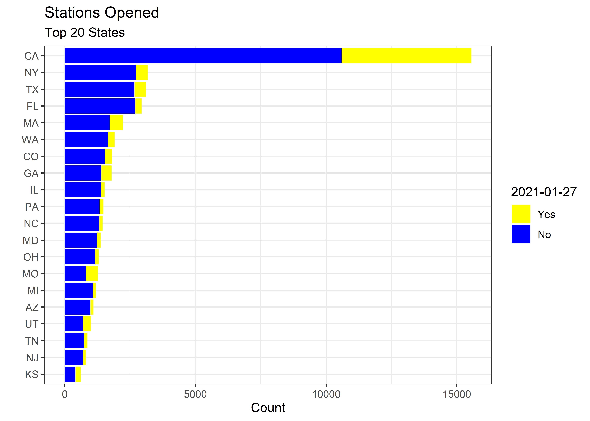
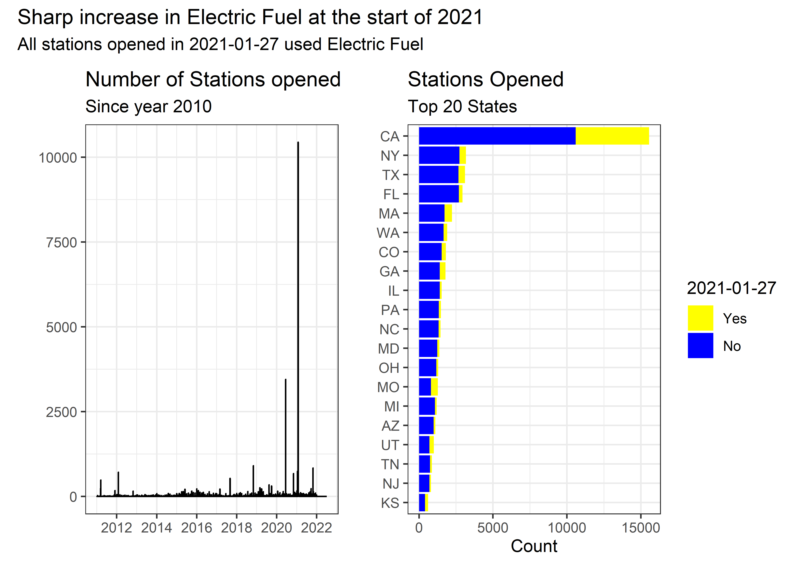

Stations
================
Matthew
2/28/2022

``` r
stations <- read_csv('https://raw.githubusercontent.com/rfordatascience/tidytuesday/master/data/2022/2022-03-01/stations.csv')
```

    ## 
    ## -- Column specification --------------------------------------------------------
    ## cols(
    ##   .default = col_character(),
    ##   X = col_double(),
    ##   Y = col_double(),
    ##   OBJECTID = col_double(),
    ##   PLUS4 = col_logical(),
    ##   BD_BLENDS = col_logical(),
    ##   EV_LEVEL1_EVSE_NUM = col_double(),
    ##   EV_LEVEL2_EVSE_NUM = col_double(),
    ##   EV_DC_FAST_COUNT = col_double(),
    ##   LATITUDE = col_double(),
    ##   LONGITUDE = col_double(),
    ##   ID = col_double(),
    ##   FEDERAL_AGENCY_ID = col_double(),
    ##   HYDROGEN_STATUS_LINK = col_logical(),
    ##   LPG_PRIMARY = col_logical(),
    ##   E85_BLENDER_PUMP = col_logical(),
    ##   INTERSECTION_DIRECTIONS_FRENCH = col_logical(),
    ##   ACCESS_DAYS_TIME_FRENCH = col_logical(),
    ##   BD_BLENDS_FRENCH = col_logical(),
    ##   HYDROGEN_IS_RETAIL = col_logical(),
    ##   CNG_DISPENSER_NUM = col_double()
    ##   # ... with 8 more columns
    ## )
    ## i Use `spec()` for the full column specifications.

``` r
stations <- stations %>%
  select(where(~any(!is.na(.x)))) %>%
  rename_with(tolower) %>%
  select(-objectid) %>%
  mutate(open_date = as.Date(open_date))
```

# EDA

``` r
stations %>%
  keep(is.numeric) %>%
  gather() %>%
  ggplot(aes(value)) + geom_histogram() + facet_wrap(~key, scales = "free")
```

    ## `stat_bin()` using `bins = 30`. Pick better value with `binwidth`.

<!-- -->

``` r
stations %>%
  group_by(state) %>%
  count(fuel_type_code) %>%
  mutate(total = sum(n)) %>%
  filter(!is.na(n)) %>%
  ggplot(aes(n, y = fct_reorder(state, total), fill = fct_reorder(fuel_type_code, n))) +
  geom_col() + labs(y = "State", x = "Count", fill = "Fuel") +
  scale_fill_brewer(palette = "Dark2", direction = -1)
```

<!-- -->

## Observing date 2021-01-07

``` r
(p1 <- stations %>%
  filter(year(open_date) > 2010) %>%
  count(open_date, sort = TRUE) %>%
  ggplot(aes(open_date, n)) + geom_line() + 
  labs(title = "Number of Stations opened by day", x = "", y = "",
       subtitle = "Since year 2010"))
```

<!-- -->

``` r
stations %>%
  filter(open_date == "2021-01-27") %>%
  count(fuel_type_code)
```

    ## # A tibble: 1 x 2
    ##   fuel_type_code     n
    ##   <chr>          <int>
    ## 1 ELEC           10446

``` r
x <- stations %>%
  filter(open_date == "2021-01-27") %>%
  count(state, sort = TRUE) %>%
  head(20) %>%
  select(state)

(p2 <- stations %>%
  filter(!is.na(open_date)) %>%
  select(open_date, state) %>%
  mutate(key = ifelse(open_date == "2021-01-27", "Yes", "No")) %>%
  group_by(key) %>%
  count(state) %>%
  filter(state %in% x$state) %>%
  ggplot(aes(n, fct_reorder(state, n), fill = fct_rev(as.factor(key)))) + geom_col() +
  labs(fill = "2021-01-27", y = "", x = "Count", title = "Stations Opened", subtitle = "Top 20 States") + 
  scale_fill_manual(values = c("yellow","blue")))
```

<!-- -->

``` r
p1 + p2 + plot_annotation(title = "Sharp increase in Electric Fuel at the start of 2021",
                          subtitle = "All stations opened in 2021-01-27 used Electric Fuel")
```

<!-- -->

``` r
stations %>%
  mutate(dow = weekdays(open_date),
         dow = fct_relevel(dow, "Monday", "Tuesday", "Wednesday", "Thursday", 
                          "Friday", "Saturday", "Sunday")) %>%
  filter(!is.na(dow)) %>%
  group_by(dow) %>%
  ggplot(aes(dow, fill = fuel_type_code)) + geom_bar() +
  labs(fill = "Fuel", y = "Count", x = "")
```

<!-- -->
